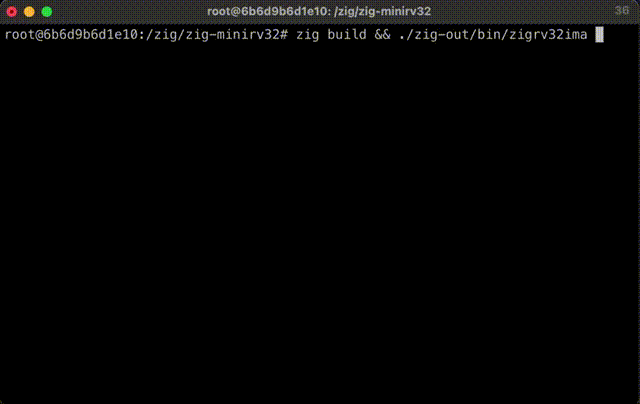

# zig-minirv32ima

Toby Jaffey https://mastodon.me.uk/@tobyjaffey

A pure zig port of https://github.com/cnlohr/mini-rv32ima

    zig build && ./zig-out/bin/zigrv32ima linux.bin

Type ctrl-`a` then `x` to exit.

Tested with `zig 0.11.0-dev.1507+6f13a725a` on linux/aarch64.

libc is linked for access to the raw terminal. To remove, comment out `lib.linkSystemLibraryName("c");` in `build.zig`.
The `term` struct could be replaced by this minimal stub:

    const term = struct {
        pub fn init() void {
        }
        pub fn getch() ?u8 {
            return null;
        }
    };

